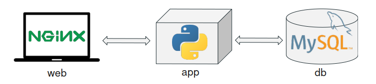
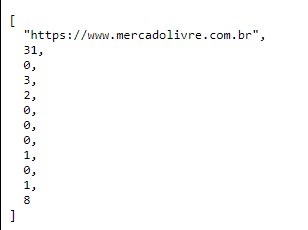

# Challenge ML
This repository is used to store the first version of code developed to solve the challenge proposed by ML data team.

Architecture
---------------------------
The application has its functionality separated in three-tiers, following a microservice architecture. They are:
 - UI tier – running on a nginx service
 - Logic tier – with Python component
 - Data tier – MySQL database to persist the data 




Project Structure
---------------------------
The files structure project is being design to isolate the files and configurations for each service. It does this by having a dedicated directory per service inside the project one. This is very useful to have a clean view of the components and to easily containerize each service. It also helps in manipulating service specific files without having to worry that we could modify by mistake other service files.

Project  
├─── web  
└─── app  
└─── db

To initialize the application, at the root directory of the project, it´s necessary to run the follow docker command:
```bash
docker-compose up -d
```
Business Rules
---------------------------
In this first delivery, the crawler´s process collects only absolute URL, i.e, URL that contains "http://" and "https://".
To configure depth level at which the crawler reaches, you should change the "depth" parameter in the "config.ini" file.

The initial base set was built based on the tb_base_set table, and you can find more details in the init.sql file.  

About the characteristics extracted from the link, we can see below one by one and its respective description
- feature 01: the length of url
- feature 02: the length of querystring
- feature 03: the number of dots
- feature 04: the number of forward slashes
- feature 05: the number of ampersand
- feature 06: the number of hyphen
- feature 07: the number of underscore
- feature 08: if exists www
- feature 09: the number of at
- feature 10: if exists .com

REST API
---------------------------
Finally, we have a REST API to return a vector with the features and the "appearances" of a link.
To access the API, we should use the follow address:
 
- http://127.0.0.1/api/v1/resources/search?url=<url>, which \<url> is the address you want to extract the info.

For instance, to return the information for the "https://www.google.com/", we have to enter this:

- http://127.0.0.1/api/v1/resources/search?url=https://www.google.com/

If the number of “appearances” for this URL is already calculated, the API will return it and, the other features. If not, the information must be predicted by the model and returned.

This API will generate as return a list with 12 components. Each one of these components are described below by their respective position:

- position 1: the url
- position 2: the length of url
- position 3: the length of querystring
- position 4: the number of dots
- position 5: the number of forward slashes
- position 6: the number of ampersand
- position 7: the number of hyphen
- position 8: the number of underscore
- position 9: if exists www
- position 10: the number of at
- position 11: if exists .com
- position 12: the quantity of appearances



Run Test
---------------------------
## Pre-requisites
Please make sure you have the following installed and can run them
* Python (3.9 or later)
* Pipenv

## Install all dependencies
```bash
pipenv install --dev
```
### Run integration tests
```bash
pipenv run integration-test
```
### Use linter
```bash
pipenv run linter
```

Points to Improve
---------------------------
Some points need to be improved on a future version. They are listed below:
* Refactor "db.py" module to remove boilerplate code
* Implement more integration tests
* Review the text in the "Readme" file


